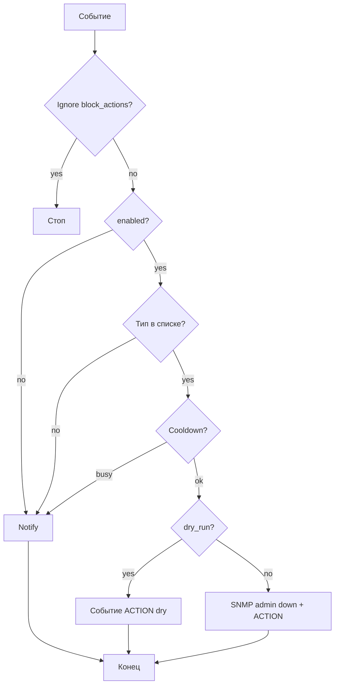

# Действия при инцидентах

Опциональная автоматическая реакция на события. **По умолчанию выключено.**

## Текущее состояние (0.6.0)

В `notification_settings` и UI **Настройки → Уведомления → Действия при инцидентах**:

| Поле | Смысл | Default |
|------|--------|---------|
| `incident_action_enabled` | вкл/выкл | `false` |
| `incident_action_event_types` | типы через запятую | ≈ `UNKNOWN_MAC_ON_ACCESS_PORT` |
| `incident_action_dry_run` | лог без SNMP SET | `false` |
| `incident_action_cooldown_seconds` | не повторять на том же порту | **300** |

При срабатывании: `actions.TryPortAdminDown` → SNMP SET `ifAdminStatus=2` (или dry-run) + событие `PORT_ADMIN_DOWN_ACTION`.  
Также возможен путь из link-trap (`TrapLinkIncidentAction`), если traps и effects это допускают.

**Кто включает:** **operator+** (не только admin). См. [Roles.md](Roles.md).

**Ignore list** на порту с `block_actions` блокирует действие — [Ignore-List.md](Ignore-List.md).

**Аудит:** пишется событие `PORT_ADMIN_DOWN_ACTION`; отдельной записи в `audit_log` для auto-action **пока нет**.

## Принципы

| Принцип | Решение |
|--------|---------|
| Default off | `incident_action_enabled=false` |
| Явное включение | operator/admin в UI / `PATCH /settings/notifications` |
| Dry-run | `incident_action_dry_run` |
| Cooldown | `incident_action_cooldown_seconds` + таблица cooldown |
| SNMP write | RW community / v3 write — [SNMP-Community.md](SNMP-Community.md) |

## Уже есть / ещё нет

| Есть | Backlog |
|------|---------|
| admin_down (MVP) | admin_up / карантин по таймеру |
| dry-run + cooldown + UI | per-device / per-port rules |
| глобальный список типов | webhook_action, vendor_script |
| событие ACTION | отдельный журнал действий; audit_log на auto-action |

Целевая таблица `incident_action_rules` — в Roadmap (релиз E), **не** в текущей схеме как обязательная.

## Алгоритм

## Риски

- Ложное срабатывание на uplink → ignore + роли портов + shut-impact в InvestigateMAC.
- Повтор без cooldown → петля admin down / link down.
- RW community на production — сначала dry-run.

## Порядок доработок (backlog)

1. Per-device / per-port override.
2. Webhook action.
3. admin_up / карантин.
4. audit_log на auto-action.
