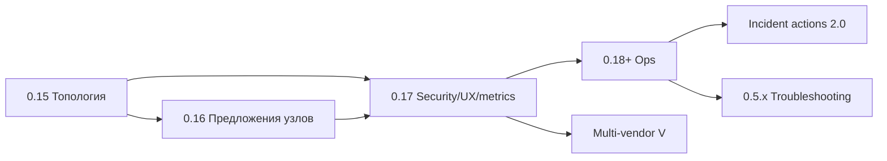

# Roadmap NetLynx

Живой план развития. Эталон git — `example`, ветка `main`.

**Текущая версия продукта:** **0.6.0** (см. `VERSION` в корне репозитория).

Связанные документы: [Vendors.md](Vendors.md) · [To-Do.md](To-Do.md) · [TZ-snmp-switch-monitor.md](TZ-snmp-switch-monitor.md) · [Incident-Actions-Plan.md](Incident-Actions-Plan.md) · [MAC-Investigation.md](MAC-Investigation.md) · [Loop-Investigation.md](Loop-Investigation.md) · [Postmortem.md](Postmortem.md).

---

## Git: example → home → GitHub

| Remote | URL | Роль |
|--------|-----|------|
| **example** | `https://github.com/PTah/NetLynx` | **эталон**: обычные коммиты, полный журнал в README |
| **home** | `https://github.com/PTah/NetLynx` | приватное зеркало (`Push-HomeMirror`) |
| **github** | `https://github.com/PTah/NetLynx` | **публичное зеркало**: orphan + hard sanitize (`Publish-GithubOrphan.ps1`) |

**Порядок:** commit/push в **example** → при необходимости зеркало **home** → publish на GitHub только по явной команде.

На GitHub перед push убираются: `.cursor/`, Cursor-trailers, внутренние хосты/IP/логины/имена устройств. Журнал версий в README на GitHub **не ведём** (см. 0.37.1).

NetLynx — идейный продолжатель Invetor (переименование 0.36.0); в коде остаются legacy-имена БД `invetor` и env-fallback — намеренно.

---

## Как читать To-Do и «Отложено»

Разделы **«Аудит backlog»** и **«Отложено»** в [To-Do.md](To-Do.md) — сознательный backlog (refactor UI, desktop parity, polish).  
**MVP и основные этапы ТЗ в проде** — сверка в [TZ §12](TZ-snmp-switch-monitor.md#12-статус-реализации-актуально-на-05x). Открытые `[ ]` = «когда дойдём руки», не «пропустили при релизе».

---

## Сводка: что уже есть (0.6.0)

| Область | Статус |
|---------|--------|
| SNMP-опрос, FDB, LLDP/CDP/**FDB-соседи**, PoE, CPU, события | **в проде** |
| Топология (фильтры, layout), `/discovered` → promote, ручные рёбра | **готово** |
| Auth/RBAC, JWT, audit, backup ZIP, Prometheus | **готово** |
| **Расследование:** MAC, Петли LLDP, Postmortem | **готово** (0.5.4–0.5.20+) |
| Config snapshots + diff (show run), STP-события, broadcast storm | **готово** |
| Traceroute / TCP-probe с сервера | **готово** (0.5.12 / 0.5.14) |
| Incident actions: dry-run + cooldown + admin_down | **готово**; per-device rules — backlog |
| Trap logs: фильтры, OID decode, режимы LINK из trap | **готово** (0.37.19+) |
| Runbook Linux / Windows Server / Vendors W1–W2 | **готово** |
| Документация синхронизирована с кодом | **0.5.48+ / 0.6.0** |
| Карточка коммутатора — закладки + **VLAN database / порты** | **0.6.0** (закладки с **0.5.49**, CRUD+trunk **0.5.51–0.5.62**) |
| Windows desktop | **не готов** (черновик Electron) |
| Multi-vendor W1/W2 | **L2 в коде**; Ubiquiti / ELTEX / SNR — **L2–L3** |
| Multi-vendor **W3** (Keenetic, Cudy, …) | **не начато**, без срока — после polish W1/W2 и живого железа |

**Модель развёртывания:** один сайт → одна инсталляция (API + веб + poller + Postgres). Inventory в PostgreSQL NetLynx; опционально UISP. **NetBox не используется.**

---

## Приоритеты «дальше»

### 1. Релиз E — Incident actions 2.0

По [Incident-Actions-Plan.md](Incident-Actions-Plan.md):

| Задача | Статус |
|--------|--------|
| dry-run + cooldown | **готово** (UI в Настройки → Уведомления) |
| admin_down при инциденте | **готово** |
| правила per-device | открыто |
| webhook как action | открыто |
| admin_up / карантин | открыто |

### 2. Hardening + ops (незакрытое)

| # | Задача | Статус |
|---|--------|--------|
| D3 | CI: расширить API auth/RBAC tests | открыто |
| C1 | Выбор ifIndex на графике; сравнение 2–4 портов | открыто |
| D5 | Полный паритет desktop с web | **отложено** |
| — | SNMP Walk UI | **отложено** (To-Do) |
| — | Last-Event-ID SSE; Basic legacy removal; BOM в CI | открыто |

### 3. Vendors — polish

Детали — [Vendors.md](Vendors.md). W1/W2 polish (PoE MIB, isolate); **W3** (Keenetic/Cudy/Tenda/Origo/ExeGate) — **не начата, срока нет** (после polish W1/W2 и доступа к железу).

### 3a. VLAN (карточка коммутатора)

| Этап | Статус |
|------|--------|
| Закладки на карточке switch | **0.5.49** |
| VLAN database — чтение + VLAN на порту | **0.5.51** |
| VLAN database: имя и удаление (CLI по вендору) | **0.5.53–0.5.55** |
| Создание VLAN + trunk Allow vlan UI | **0.5.58** |
| Массовое удаление; блок если VLAN на портах | **0.5.59–0.5.60** |
| Предупреждение management VLAN; без FDB-призраков | **0.5.61–0.5.62** |
| **Релиз линии VLAN** | **0.6.0** |
| MikroTik CRS: bridge vlan (+ comment / порты) | **next** |
| Колонка trunk allowed в таблице портов | polish |

### 4. Проверка на железе

| Контур | Как проверяем |
|--------|----------------|
| Ubiquiti, ELTEX, SNR | живые свитчи в сети |
| W1/W2 | unit-тесты + CLI/MIB; без свитча — осторожно |

---

## Вне scope (ближайшие релизы)

HA, remote pollers / федерация, NetBox как CMDB, произвольный SSH вне allowlist — см. историю ниже; **не планируем** в ближайших версиях.

---

## История релизов (архив)

Кратко; детали — `git log`, README, [To-Do.md](To-Do.md).

### A–C′ — топология, discovered, security, manual links — **готово** (0.15–0.21)

### 0.37.x — документация, notify, audit, traps UI — **готово**

### 0.5.x — траблшутинг — **готово** (ядро)

MAC investigate, config snapshots, STP, postmortem, traceroute/tcp-probe, broadcast storm, FDB snapshots, loops DFS, L2-path, shut-impact — см. [To-Do.md](To-Do.md) § 0.5.x.

### E — Incident actions 2.0 — **частично**

Dry-run, cooldown, базовый admin_down — в проде. Per-device / webhook / admin_up — backlog.

### Зависимости (исторические)

---

*Обновлено: 2026-09-03 (релиз **0.6.0** — VLAN database / порты).*
